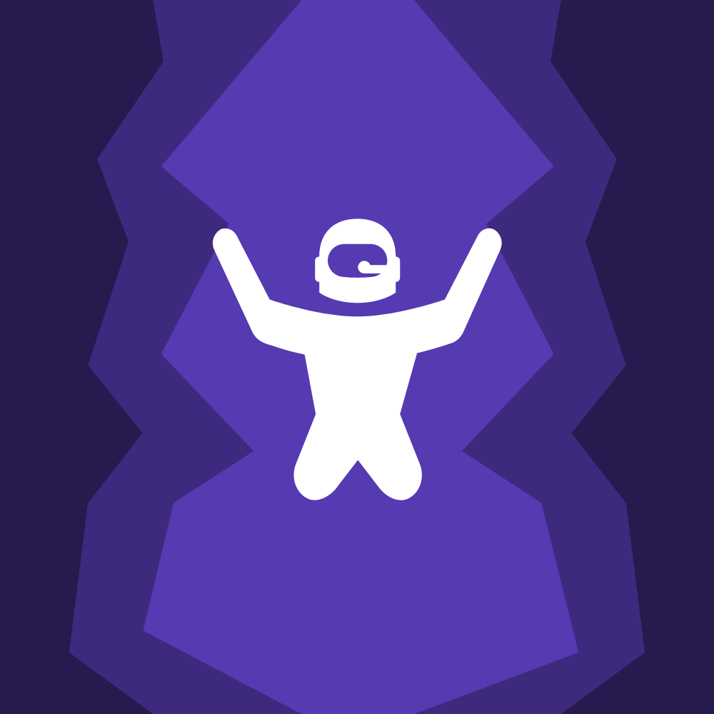

# Hyper Dive



## Overview
Hyper Dive is a hyper-casual infinite level game built with the Unity game engine. It's an intense cave-diving experience where players control a character falling through deep caverns with increasingly challenging obstacles. The game features vibrant visuals, addictive gameplay, and has achieved over 10,000+ downloads on the App Store.

In Hyper Dive, players guide a character falling through endless deep caverns filled with various hazards and collectibles. As the character descends deeper, oxygen levels deplete, requiring players to collect oxygen tanks to stay alive. The deeper the dive, the more challenging it becomes with poison gas and more difficult obstacles appearing. The game employs a one-touch control mechanism where players tap to change direction, making it accessible to gamers of all skill levels while still providing a challenging experience as the difficulty increases over time.

## Game Demo
**Note**: The gameplay video file (`appIntroHyperInsta.mov`) has been excluded from the GitHub repository due to its large size (283 MB). You can download it separately or view it from the original project files.

## Features
- **Infinite Gameplay**: Procedurally generated caverns that become progressively more challenging the deeper you go
- **Simple Controls**: Easy to learn, difficult to master one-touch gameplay
- **Oxygen Management**: Strategic collection of oxygen tanks to survive longer dives
- **Hazard Avoidance**: Navigate around various obstacles and poison gas zones
- **Gem Collection**: Gather gems to upgrade your character and abilities
- **In-App Purchases**: Various gem packages for enhancing gameplay and unlocking content
- **Reward System**: Watch ads to continue gameplay after failing
- **Vibrant Visuals**: Colorful cavern-themed graphics with dynamic visual effects
- **Cross-Platform**: Available on both iOS and Android platforms
- **Leaderboards**: Compete for the deepest dive with friends and players worldwide
- **Achievement System**: Complete challenges to earn rewards
- **Character Customization**: Unlock and upgrade different characters
- **Optimized Performance**: Smooth gameplay on a wide range of devices

## Screenshots

### Gameplay Screenshots


## Game Mechanics

### Core Gameplay
- **Movement System**: Tap to change direction while constantly falling downward
- **Oxygen Management**: Oxygen depletes over time and must be replenished by collecting oxygen tanks
- **Hazard Avoidance**: Navigate around obstacles and avoid poison gas zones that appear deeper in the caverns
- **Gem Collection**: Collect gems throughout the dive to use for upgrades and character customization
- **Scoring**: Points are earned based on depth reached, gems collected, and obstacles avoided
- **Difficulty Progression**: Obstacle density and poison gas zones increase as the player descends deeper
- **Power-ups**: Collect special items for temporary abilities like extra oxygen, invincibility, or gem magnets

### Monetization
- **In-App Purchases**: Various gem packages available for purchase
- **Reward Ads**: Watch advertisements to continue after failing or to earn bonus gems
- **Premium Content**: Special characters and visual effects available through purchases

## Technical Details

### Project Structure
- **Assets/**: Contains all game assets
  - **scripts/**: Core game logic scripts
  - **prefab/**: Reusable game objects
  - **resource/**: Textures, models, and other visual assets
  - **Animation/**: Character and UI animations
  - **Scenes/**: Different game scenes
  - **materials/**: Material definitions for game objects
  - **TextMesh Pro/**: Text rendering system
  - **GoogleMobileAds/**: Ad integration components
  - **Plugins/**: Third-party plugins and extensions

### Key Scripts
- **move.cs**: Controls character movement, physics, and collision detection during the dive
- **platformGenerator.cs**: Procedurally generates cavern elements and obstacles
- **obstacles.cs**: Manages obstacle behavior, patterns, and difficulty scaling as depth increases
- **scoreManager.cs**: Handles scoring system based on depth, gems, and survival time
- **shopManager.cs**: Manages in-game store, character upgrades, and inventory
- **levelManager.cs**: Controls depth progression, oxygen depletion, and poison gas intensity
- **Admanager.cs & Admob.cs**: Handle ad integration and reward systems
- **IAPManager.cs**: Manages in-app purchases and store integration
- **cameraControler.cs**: Controls camera movement, effects, and shake animations
- **dimond.cs**: Handles collectible gem behavior and effects
- **heartGemLife.cs**: Manages oxygen tank collection and oxygen level mechanics

### Design Patterns
- **Singleton Pattern**: Used for managers like AdManager, IAPManager
- **Object Pooling**: Implemented for efficient spawning of obstacles and collectibles
- **Component-Based Architecture**: Game objects are composed of modular components
- **Event System**: For communication between different game systems

### Prerequisites
- Unity 2019.4 LTS or later
- For iOS deployment:
  - Xcode 12.0 or later
  - Apple Developer account
  - macOS 10.15 or later
- For Android deployment:
  - Android Studio
  - Google Play Developer account
  - JDK 8 or later
  - Android SDK API level 21 or higher

### Development Environment Setup
1. **Clone the Repository**
   ```bash
   git clone https://github.com/yourusername/hyper-dive.git
   cd hyper-dive
   ```

2. **Open the Project in Unity**
   - Launch Unity Hub
   - Click 'Add' and browse to the cloned project directory
   - Select the project and open it with Unity 2019.4 LTS or compatible version

3. **Install Required Packages**
   The project uses the following Unity packages that should be automatically installed:
   - TextMesh Pro
   - Unity IAP
   - Google Mobile Ads
   - Unity Analytics

4. **Configure Build Settings**
   - Go to `File > Build Settings`
   - Select your target platform (iOS or Android)
   - Click 'Switch Platform'
   - Configure the appropriate player settings for your target platform

### Building for iOS
1. **Configure Player Settings**
   - Go to `Edit > Project Settings > Player`
   - Set Bundle Identifier (e.g., com.yourcompany.hyperdive)
   - Configure other iOS-specific settings

2. **Build the Project**
   - Go to `File > Build Settings`
   - Click 'Build' or 'Build and Run'
   - Select a destination folder for the Xcode project

3. **Finalize in Xcode**
   - Open the generated Xcode project
   - Configure signing with your Apple Developer account
   - Set capabilities as needed (In-App Purchases, etc.)
   - Build and run on a device or simulator

### Building for Android
1. **Configure Player Settings**
   - Go to `Edit > Project Settings > Player`
   - Set Bundle Identifier (e.g., com.yourcompany.hyperdive)
   - Configure other Android-specific settings

2. **Build the Project**
   - Go to `File > Build Settings`
   - Click 'Build' or 'Build and Run'
   - Select a destination folder and filename for the APK

3. **Testing on Device**
   - Enable Developer options and USB debugging on your Android device
   - Connect your device to your computer
   - Install the APK directly or through Android Studio

### Running the Game

#### In Unity Editor
1. **Open the Project**
   ```bash
   # Navigate to the Unity Hub application
   open -a "Unity Hub"
   # Or launch Unity directly with the project path
   /Applications/Unity/Hub/Editor/2019.4.40f1/Unity.app/Contents/MacOS/Unity -projectPath "/path/to/hyper-dive"
   ```

2. **Load the Main Scene**
   - In the Project window, navigate to `Assets/Scenes/`
   - Double-click on `MainMenu.unity` to open it
   - Alternatively, use the keyboard shortcut: Ctrl+O (Windows) or Cmd+O (Mac), then select the scene file

3. **Run the Game in Editor**
   - Click the Play button at the top center of the Unity Editor
   - Or use the keyboard shortcut: Ctrl+P (Windows) or Cmd+P (Mac)
   - To stop the game, click the Play button again or press the same shortcut

4. **Debug Mode**
   - To run in debug mode with console output:
     ```bash
     # For macOS
     /Applications/Unity/Hub/Editor/2019.4.40f1/Unity.app/Contents/MacOS/Unity -projectPath "/path/to/hyper-dive" -logFile -console
     ```

#### On iOS Device
1. **Install via Xcode**
   ```bash
   # Open the Xcode project
   open "/path/to/ios-build/Unity-iPhone.xcodeproj"
   ```
   - Connect your iOS device
   - Select your device from the target dropdown
   - Click the Play button to build and run

2. **Install via Terminal (for developers)**
   ```bash
   # Using ios-deploy tool (needs to be installed via npm or brew)
   ios-deploy --bundle "/path/to/HyperDive.app" --id [DEVICE_UDID]
   ```

#### On Android Device
1. **Install via ADB**
   ```bash
   # Make sure ADB is in your PATH
   adb install -r "/path/to/HyperDive.apk"
   ```

2. **Run Logcat for Debugging**
   ```bash
   adb logcat -s Unity ActivityManager PackageManager
   ```

#### Game Controls and Usage
1. **Main Menu Navigation**
   - Tap the "Play" button to start a new game
   - Tap the "Shop" button to access character upgrades and purchases
   - Tap the "Settings" button to adjust sound, music, and other preferences
   - Tap the "Leaderboard" button to view high scores

2. **Gameplay Controls**
   - Tap anywhere on the screen to change the character's direction
   - Tap and hold for more precise control in challenging sections
   - Swipe (if enabled in settings) for special maneuvers

3. **In-Game Actions**
   - Collect blue oxygen tanks to replenish oxygen levels
   - Collect gems for currency and score
   - Avoid obstacles and poison gas zones
   - Pause the game by tapping the pause button in the top corner

## Customization and Extension

### Adding New Content
1. **Creating New Obstacles**
   - Duplicate existing obstacle prefabs in `Assets/prefab/`
   - Modify their appearance and behavior
   - Add them to the obstacle spawner in the appropriate scenes

2. **Adding New Characters**
   - Create new character models or modify existing ones
   - Add them to the shop system in `shopManager.cs`
   - Configure their properties and unlock conditions

3. **Modifying Difficulty**
   - Adjust parameters in `levelManager.cs` to change difficulty progression
   - Modify spawn rates and patterns in `spawner.cs`

### Monetization Configuration
1. **Configuring AdMob**
   - Replace placeholder ad unit IDs in `Admanager.cs` and `Admob.cs` with your own
   - Test ads using test mode before deploying

2. **Setting Up In-App Purchases**
   - Configure product IDs in `IAPManager.cs`
   - Set up products in your App Store Connect or Google Play Console

## Troubleshooting

### Common Issues
- **Build Errors**: Ensure all required packages are installed and compatible
- **Performance Issues**: Check for memory leaks or excessive instantiation
- **Ad Integration Problems**: Verify correct implementation of ad unit IDs
- **IAP Issues**: Confirm proper configuration in both code and developer consoles

### Debug Tools
- Enable debug logging by uncommenting debug lines in key scripts
- Use Unity Profiler to identify performance bottlenecks
- Test IAP functionality using sandbox environments

## Important Note Before Pushing to GitHub
Before pushing this project to GitHub, the following sensitive information has been removed:

1. Ad IDs in Admanager.cs and Admob.cs:
   - App ID: "ca-app-pub-XXXXXXXXXXXXXXXX~XXXXXXXXXX"
   - Reward ID: "ca-app-pub-XXXXXXXXXXXXXXXX/XXXXXXXXXX"

2. Any API keys or sensitive credentials in configuration files

## Credits
- **Game Design & Development**: Original Creator
- **Art Assets**: Custom-made and Unity Asset Store
- **Sound Effects**: Various royalty-free sources
- **Special Thanks**: To the Unity community for resources and support

## License
This project is licensed under the MIT License - see the LICENSE file for details.
